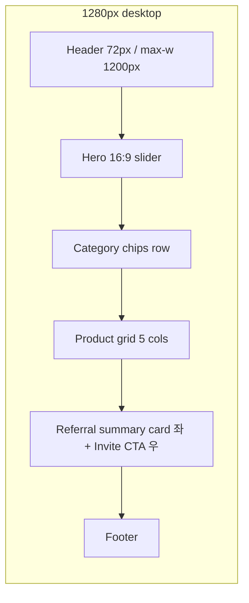

# 02. 디자이너 스펙 — Nuxia 커머스 × 3세대 레퍼럴

> 작성자: `ux-designer`
> 참조 입력: `_workspace/01_analyst_requirements.md`
> 참조 브랜드: Nuxia (https://www.nuxia.co.kr/About/Introduce)
> 대상: Next.js 14 + Tailwind + shadcn/ui / Capacitor iOS+Android 하이브리드
> 우선 뷰포트: 360px (모바일 퍼스트)
> 접근성 기준: WCAG 2.1 AA

---

## Nuxia 접근 상태

- **접근 결과**: 부분 성공 (페이지 HTML 구조·섹션 배치·스크롤 인터랙션은 관찰, 구체적 색상 hex와 폰트 패밀리 hex는 외부 CSS 내부로 미노출)
- **대응**: 관찰된 "원리"(세련된 진한 톤, 흰색 베이스, 60px 섹션 수직 리듬, 3열 카드 그리드, lerp 기반 추종 애니메이션, 스크롤 100px 헤더 상태 전이, 7초 자동 슬라이더)는 반영. 정량 값(hex, font-size, font-family 변형)은 스킬의 **폴백 토큰 세트**를 기반으로 엔터프라이즈 블루 계열을 확정.
- **문서 상단 명시**: "Nuxia 실제 hex/폰트 미노출 → 폴백 토큰 세트 적용. 구조·간격·인터랙션 원리는 실제 관찰 반영."

---

## 1. Nuxia 스타일 관찰 요약

### 1-1. 색상
- **베이스**: 순백(`#FFFFFF`) 캔버스. 이미지·타이포가 주인공이며 배경은 최대한 물러난다.
- **주색 인상**: 차분하고 진한 네이비/블루-블랙 톤으로 기업 신뢰감. 강렬한 비비드 색은 지양.
- **보조**: 저채도 회색 스케일로 정보 위계 구성. 경계선은 얇고 저대비.
- **강조**: 브랜드 이미지/제품 비주얼 자체가 강조 포인트로 기능.

### 1-2. 타이포그래피
- 한글 본문에 Pretendard/Noto Sans KR 계열로 추정되는 변동폭 큰 산세리프 사용.
- 제목(`<h3>`, `<h4>`)은 본문 대비 굵기·사이즈 격차 명확. "당신의 시작이 곧, 우리의 출발입니다" 같은 문장형 헤드라인이 중심.
- 본문은 넉넉한 `line-height`로 호흡 확보.

### 1-3. 레이아웃
- 콘텐츠 폭은 100% 기반 반응형이며, 섹션 간 `margin-bottom: 60px` 리듬이 관찰됨 → **주 수직 리듬 64~96px** 채택.
- 고정 헤더 + 우측 추종 메뉴 구조.
- 모바일에서는 단일 컬럼, 데스크톱에서 2~3열로 확장.

### 1-4. 섹션 패턴
- (a) 히어로 메시지 중심 오프닝
- (b) 좌우 분할(이미지+텍스트) 브랜드 소개
- (c) 3열 카드 그리드(NUXIA Brands)
- (d) 숫자/가치 강조 블록
- (e) 푸터: 회사정보·인증·전화(1670-2575)

### 1-5. 마이크로 인터랙션
- 스크롤 100px 임계에서 헤더 축소/배경 전환.
- 우측 메뉴가 lerp(지수 보간)로 부드럽게 추종.
- Swiper 7초 자동 재생 슬라이더.
- 링크는 밑줄 없이 호버 시 서서히 색 전환.

---

## 2. 디자인 토큰 JSON

> Tailwind `theme.extend` 에 직접 매핑 가능한 구조. 프론트엔드는 `tailwind.config.ts` 의 `extend` 속성에 이 JSON 을 펼쳐 붙이면 됨.

```json
{
  "colors": {
    "background": "#FFFFFF",
    "foreground": "#0F172A",
    "primary": {
      "DEFAULT": "#0F172A",
      "foreground": "#FFFFFF",
      "hover": "#1E293B"
    },
    "secondary": {
      "DEFAULT": "#F1F5F9",
      "foreground": "#0F172A",
      "hover": "#E2E8F0"
    },
    "accent": {
      "DEFAULT": "#2563EB",
      "foreground": "#FFFFFF",
      "hover": "#1D4ED8"
    },
    "muted": {
      "DEFAULT": "#F8FAFC",
      "foreground": "#64748B"
    },
    "border": "#E2E8F0",
    "border-strong": "#CBD5E1",
    "input": "#F1F5F9",
    "ring": "#2563EB",
    "commerce": {
      "price": "#0F172A",
      "priceOriginal": "#94A3B8",
      "discount": "#DC2626",
      "inStock": "#16A34A",
      "lowStock": "#F59E0B",
      "soldOut": "#64748B"
    },
    "referral": {
      "gen1": "#64748B",
      "gen2": "#2563EB",
      "gen3": "#7C3AED",
      "earn": "#16A34A",
      "withheld": "#F59E0B",
      "revert": "#DC2626",
      "blocked": "#B91C1C"
    },
    "status": {
      "success": "#16A34A",
      "warning": "#F59E0B",
      "error": "#DC2626",
      "info": "#2563EB"
    }
  },
  "fontFamily": {
    "sans": ["Pretendard Variable", "Pretendard", "system-ui", "-apple-system", "BlinkMacSystemFont", "Noto Sans KR", "sans-serif"],
    "mono": ["SF Mono", "JetBrains Mono", "D2Coding", "monospace"]
  },
  "fontSize": {
    "caption": ["12px", { "lineHeight": "16px", "letterSpacing": "-0.005em" }],
    "body-sm": ["13px", { "lineHeight": "18px", "letterSpacing": "-0.01em" }],
    "body": ["14px", { "lineHeight": "22px", "letterSpacing": "-0.01em" }],
    "lead": ["16px", { "lineHeight": "26px", "letterSpacing": "-0.01em" }],
    "h4": ["20px", { "lineHeight": "28px", "letterSpacing": "-0.02em", "fontWeight": "600" }],
    "h3": ["24px", { "lineHeight": "32px", "letterSpacing": "-0.02em", "fontWeight": "700" }],
    "h2": ["32px", { "lineHeight": "40px", "letterSpacing": "-0.025em", "fontWeight": "700" }],
    "h1": ["40px", { "lineHeight": "48px", "letterSpacing": "-0.03em", "fontWeight": "800" }],
    "display": ["56px", { "lineHeight": "64px", "letterSpacing": "-0.035em", "fontWeight": "800" }],
    "price-lg": ["28px", { "lineHeight": "32px", "letterSpacing": "-0.025em", "fontWeight": "700" }],
    "earnings-xl": ["40px", { "lineHeight": "44px", "letterSpacing": "-0.03em", "fontWeight": "800" }]
  },
  "spacing": {
    "xs": "4px",
    "sm": "8px",
    "md": "12px",
    "base": "16px",
    "lg": "24px",
    "xl": "32px",
    "2xl": "48px",
    "section": "64px",
    "section-lg": "96px",
    "touch": "44px",
    "tabbar": "56px",
    "header": "56px",
    "safe-top": "env(safe-area-inset-top)",
    "safe-bottom": "env(safe-area-inset-bottom)"
  },
  "borderRadius": {
    "none": "0",
    "xs": "4px",
    "sm": "6px",
    "md": "10px",
    "lg": "16px",
    "xl": "24px",
    "pill": "999px",
    "card": "12px",
    "button": "8px"
  },
  "boxShadow": {
    "none": "none",
    "card": "0 2px 8px rgba(15, 23, 42, 0.06)",
    "card-hover": "0 4px 16px rgba(15, 23, 42, 0.08)",
    "elevated": "0 8px 24px rgba(15, 23, 42, 0.10)",
    "sheet": "0 -4px 24px rgba(15, 23, 42, 0.12)",
    "focus": "0 0 0 3px rgba(37, 99, 235, 0.35)"
  },
  "lineHeight": {
    "tight": "1.15",
    "snug": "1.3",
    "normal": "1.5",
    "relaxed": "1.7",
    "loose": "1.9"
  },
  "zIndex": {
    "base": "0",
    "raised": "10",
    "header": "40",
    "tabbar": "40",
    "dropdown": "50",
    "sheet": "60",
    "modal": "70",
    "toast": "80"
  },
  "transition": {
    "snap": "120ms cubic-bezier(0.4, 0, 0.2, 1)",
    "base": "200ms cubic-bezier(0.4, 0, 0.2, 1)",
    "smooth": "320ms cubic-bezier(0.2, 0.8, 0.2, 1)",
    "lerp": "500ms cubic-bezier(0.16, 1, 0.3, 1)"
  }
}
```

**토큰 카운트**
- colors: 40 (브랜드 8 + 커머스 6 + 레퍼럴 7 + 상태 4 + 기본 15)
- fontFamily: 2
- fontSize: 12
- spacing: 16
- borderRadius: 9
- boxShadow: 6
- lineHeight: 5
- zIndex: 8
- transition: 4

---

## 3. 커머스 번안 원칙 (Nuxia 기업 톤 → 커머스 CTA/가격 위계)

| Nuxia의 원리 | 커머스에서의 번안 |
|--------------|-------------------|
| 차분한 네이비/블루-블랙 주색 | `primary`는 차분한 네이비 유지 → 브랜드/헤더/텍스트용. 구매·초대 CTA는 `accent` 블루 한 단계 명도 강조 |
| 여백 큰 타이포 중심 히어로 | 프로모션 배너 + 베스트 상품 슬라이더(7초 자동) 치환. 제품 이미지 1:1 비율 강조 |
| 숫자 강조 (매출/연혁) | 리뷰 수·평점·누적 레퍼럴 수익(원화)로 치환. 큰 숫자는 `earnings-xl` 40px |
| 좌우 분할 소개 | 상품 상세: 이미지(좌/상) + 구매 정보(우/하), 모바일은 세로 스택 |
| 3열 카드 그리드 (브랜드) | 카테고리/상품 그리드. 360px 2열, 768px 3열, 1024px 4열, 1280px 5열 |
| 스크롤 리빌 / lerp 추종 | 상품 카드 스크롤 페이드인. 결제 상단시트(TopSheet)는 `transition.lerp` 500ms |
| 밑줄 없는 링크 + 색 전환 | 인라인 링크는 `accent` 컬러 텍스트 + 호버 `accent-hover`. 버튼 외 CTA는 화살표 아이콘 동반 |
| 기업 신뢰 인증 뱃지 (푸터) | 통신판매업/사업자/개인정보처리방침 푸터 + 결제 보안 뱃지(포트원/KISA) |

**가격 위계 규칙**
1. 할인 후 가격: `price-lg` 28px `commerce.price` 블랙 볼드
2. 원가(취소선): 14px `commerce.priceOriginal` 회색
3. 할인율 뱃지: 빨강 `commerce.discount` 배경 + 흰색 텍스트, 12px
4. "3% 적립" 레퍼럴 프리뷰: `referral.earn` 텍스트, 상품 카드 우하단 12px

**CTA 위계**
- 주 CTA (구매/결제/초대하기): `accent` 배경, h-12 (48px), 풀폭(모바일)
- 보조 CTA (장바구니 담기): `primary` 배경, h-12, 풀폭
- 제3 CTA (찜/공유): 고스트 버튼, h-10 (40px) 또는 아이콘 버튼

---

## 4. 반응형 브레이크포인트 표

| 이름 | 최소 폭 | 대표 기기 | 그리드 컬럼 | 좌우 패딩 | 헤더 높이 |
|------|---------|----------|-----------|-----------|-----------|
| (기본) | 360px | iPhone SE / 갤럭시 소형 | 4 cols / 16px gutter | 16px | 56px |
| sm | 640px | 소형 태블릿 세로 | 6 cols / 16px gutter | 20px | 56px |
| md | 768px | iPad 세로 | 8 cols / 20px gutter | 24px | 64px |
| lg | 1024px | iPad 가로 / 소형 데스크톱 | 12 cols / 24px gutter | 32px | 64px |
| xl | 1280px | 표준 데스크톱 | 12 cols / 24px gutter, max-w 1200px | 40px | 72px |
| 2xl | 1536px | 와이드 데스크톱 | 12 cols / 32px gutter, max-w 1360px | 48px | 72px |

**규칙**
- 기본 스타일은 360px 세로 뷰포트 기준. 다단 컬럼은 `md:` (768px) 이상에서만 활성.
- 터치 타겟 44×44px 최소 (WCAG 2.5.5 + iOS HIG).
- 가로 스크롤 완전 금지 (iOS 확대 방지: `html { touch-action: pan-y; }`).
- 콘텐츠 최대 폭 1360px — 그 이상 뷰포트는 양쪽 여백으로 흡수.
- 상품 카드 종횡비 1:1 고정 (이미지 영역), 텍스트 영역 가변.

---

## 5. 핵심 화면 와이어프레임 (ASCII)

### 5-1. 홈 (모바일 360px)

```
┌───────────────────────────────┐
│ 🟦 NUXIA         🔍  🛒³      │ ← header (h-56, sticky)
├───────────────────────────────┤
│                               │
│   [프로모션 배너 / 7초 슬라이더]│ ← hero, 16:9
│   ● ○ ○                       │
├───────────────────────────────┤
│ [카테고리칩 · · · · · · · · →]│ ← 가로 스크롤
├───────────────────────────────┤
│ 베스트                   더보기>│
│ ┌───────┐ ┌───────┐           │
│ │ IMG   │ │ IMG   │           │ ← 2열 그리드
│ │ 89,000│ │ 120,000│          │
│ │ 3% 적립│ │ 3% 적립│          │
│ └───────┘ └───────┘           │
├───────────────────────────────┤
│ 내 레퍼럴 요약            >   │
│ ╭─────────────────────────╮   │
│ │ 이번 달 예상 수익       │   │
│ │ 250,000원               │   │
│ │ ● 1대(3%)  30,000        │   │
│ │ ● 2대(5%)  50,000        │   │
│ │ ● 3대(17%) 170,000       │   │
│ │ [초대 링크 공유하기]    │   │ ← accent CTA
│ ╰─────────────────────────╯   │
├───────────────────────────────┤
│ 푸터(통신판매업·개인정보)      │
├───────────────────────────────┤
│  🏠 홈  🔍 검색  ♡ 찜  👤 MY │ ← bottom tab, safe-bottom
└───────────────────────────────┘
```

### 5-2. 카테고리 (모바일)

```
┌───────────────────────────────┐
│ ← 의류               🔍  🛒   │
├───────────────────────────────┤
│ [정렬: 인기순 ▼] [필터 ▼]      │ ← sticky sub-header
├───────────────────────────────┤
│ ┌───┐┌───┐                    │
│ │IMG││IMG│  2열 카드 무한스크롤│
│ │89K││120K│ (Intersection)    │
│ └───┘└───┘                    │
│ ┌───┐┌───┐                    │
│ │IMG││IMG│                    │
│ │SOLD││45K│ ← 품절 카드        │
│ │OUT │    │   (overlay)       │
│ └───┘└───┘                    │
│   ↓ (더 불러오는 중)           │
└───────────────────────────────┘
```

### 5-3. 상품 상세 (모바일)

```
┌───────────────────────────────┐
│ ← 상품       ♡   ⤴   🛒      │
├───────────────────────────────┤
│                               │
│       [이미지 갤러리]          │ ← 1:1, 핀치 줌
│       ● ○ ○ ○                  │
├───────────────────────────────┤
│ 브랜드명                       │
│ 상품명 두 줄까지 말줄임…       │ ← h3
│ ─────────────────────────     │
│ -30%  ~~120,000~~             │
│ 84,000원                      │ ← price-lg
│ 3% 적립 · 무료배송             │ ← referral.earn
├───────────────────────────────┤
│ [옵션: 색상 ▼] [사이즈 ▼]      │
├───────────────────────────────┤
│ ⭐ 4.8 (312)    리뷰 보기 >    │
│ "배송 빠르고 품질 좋아요…"     │
├───────────────────────────────┤
│ 상세정보 / 배송 / 환불 [탭]    │
│ ───────                        │
│ (탭 콘텐츠)                    │
├───────────────────────────────┤
│  ♡  ⤴  [장바구니] [바로구매]  │ ← sticky bottom
└───────────────────────────────┘
```

### 5-4. 카트 (모바일)

```
┌───────────────────────────────┐
│ ← 장바구니 (3)                 │
├───────────────────────────────┤
│ ☑ 전체선택 (3/3)    선택삭제   │
├───────────────────────────────┤
│ ☑ ┌──┐ 상품명                  │
│   │IMG│ 옵션: 블랙/M           │
│   └──┘ 84,000원                │
│        [- 1 +]         [×]    │
├───────────────────────────────┤
│ ☑ ┌──┐ 상품명…                 │
│   │IMG│ …                      │
├───────────────────────────────┤
│ 쿠폰 적용      [쿠폰선택 >]    │
├───────────────────────────────┤
│ 상품 금액       168,000원       │
│ 배송비           무료           │
│ 쿠폰 할인       -10,000원       │
│ ─────────────────────           │
│ 결제 예정       158,000원       │
│ ▸ 3% 레퍼럴 예상 4,740원        │ ← 투명 안내
├───────────────────────────────┤
│   [158,000원 결제하기]         │ ← accent CTA h-14
└───────────────────────────────┘
```

### 5-5. 체크아웃 (모바일)

```
┌───────────────────────────────┐
│ ← 주문/결제                    │
├───────────────────────────────┤
│ 배송지                         │
│ 홍길동 010-****-1234           │
│ 서울시 …          [변경]       │
├───────────────────────────────┤
│ 주문 상품 (3)         펼치기 ▼  │
├───────────────────────────────┤
│ 할인/포인트                    │
│ [쿠폰 선택]                    │
│ 포인트 [____] 보유 1,200 P     │
├───────────────────────────────┤
│ 결제수단                       │
│ ○ 신용/체크카드                │
│ ● 간편결제(네이버/카카오/토스) │
│ ○ 가상계좌                     │
├───────────────────────────────┤
│ ☑ 개인정보 제3자 제공 동의     │
│ ☑ 구매 조건 확인 및 결제 동의  │
├───────────────────────────────┤
│ 결제 예정    158,000원         │
├───────────────────────────────┤
│   [158,000원 결제하기]         │
└───────────────────────────────┘
       ↓ 탭 후 TopSheet (lerp)
┌───────────────────────────────┐
│ ═══════                        │ ← drag handle
│ 포트원 V2 결제위젯 iframe       │
│ ...                            │
└───────────────────────────────┘
```

### 5-6. 레퍼럴 대시보드 (모바일, 핵심 화면)

```
┌───────────────────────────────┐
│ ← 레퍼럴                  [?] │
├───────────────────────────────┤
│ ╭─────────────────────────╮   │
│ │ 이번 달 예상 수익        │   │
│ │                          │   │
│ │   250,000원              │   │ ← earnings-xl 40px
│ │                          │   │
│ │ ●1대 3% ──────── 30,000  │   │
│ │ ●2대 5% ──────── 50,000  │   │
│ │ ●3대 17%━━━━━━━ 170,000  │   │ ← 가장 두꺼운 bar
│ │                          │   │
│ │ ℹ 3대 수익은 상위 추천인  │   │
│ │   에게 지급되는 비율입니다│   │ ← 오해 방지 문구
│ ╰─────────────────────────╯   │
├───────────────────────────────┤
│ 상태 요약                      │
│ 🟢 지급 예정  250,000원        │
│ 🟡 유보 중    42,000원 (5건)   │
│ 🔴 역정산     -9,000원 (1건)   │
├───────────────────────────────┤
│ [초대 코드 공유]               │
│ NX-ABC123  [복사]              │
│ [링크 공유] [QR 보기]          │
├───────────────────────────────┤
│ 최근 내역                  >  │
│ 04-20 ●1대 +9,000  (진행)      │
│ 04-19 ●3대 +170,000 (예정)     │
│ 04-18 ●2대 -15,000 (역정산)    │ ← revert 빨강
├───────────────────────────────┤
│ [내 트리 보기 >]               │
└───────────────────────────────┘
```

### 5-7. 내 트리 뷰 (모바일)

```
┌───────────────────────────────┐
│ ← 내 추천 트리                 │
├───────────────────────────────┤
│ 뎁스 [3대 ▼]  상태 [전체 ▼]   │
├───────────────────────────────┤
│                                │
│     👤 나 (홍길동)             │
│      │                         │
│      ├─ 🔵 김○○ (1대)          │
│      │   ├─ 🟣 이○○ (2대)      │
│      │   │   └─ 🟪 박○○ (3대) │
│      │   └─ 🟣 최○○ (2대)      │
│      │                         │
│      └─ 🔵 박○○ (1대)          │
│          └─ 🟣 정○○ (2대)      │
│                                │
├───────────────────────────────┤
│ 선택: 이○○ (2대)               │
│ ├ 가입일 2026-03-12            │
│ ├ 이번 달 기여 120,000원       │
│ ├ 내가 받을 2대 수익 6,000원   │
│ └ 상태: ✅ 정상                │
├───────────────────────────────┤
│ ⚠ 셀프레퍼럴 차단 예시          │
│ ┌───────────────────────────┐│
│ │🚫 차단됨 - 동일 인증정보   ││ ← 빨강 테두리
│ │   (색+아이콘+라벨 3중)     ││
│ └───────────────────────────┘│
└───────────────────────────────┘
```

### 5-8. 마이페이지 (모바일)

```
┌───────────────────────────────┐
│ MY                         ⚙  │
├───────────────────────────────┤
│ 👤 홍길동                      │
│ 본인인증 완료 ✅               │
│ 추천코드 NX-ABC123 [복사]       │
├───────────────────────────────┤
│ 이번 달 레퍼럴 수익             │
│ 250,000원          [대시보드>] │
├───────────────────────────────┤
│ 주문/배송                      │
│ 입금대기 0 · 배송중 1 · 완료 3 │
├───────────────────────────────┤
│ • 주문내역                  >  │
│ • 찜한 상품 (12)            >  │
│ • 리뷰 작성 가능 (2)        >  │
│ • 배송지 관리                > │
│ • 쿠폰/포인트               >  │
│ • 정산 계좌 등록      ⚠ 미등록│ ← 경고 아이콘
│ • 고객센터                  >  │
├───────────────────────────────┤
│ [로그아웃]                     │
└───────────────────────────────┘
```

### 5-9. 반응형 참고 — 홈 (데스크톱 lg+ / Mermaid 레이아웃)



---

## 6. 컴포넌트 카탈로그

> shadcn/ui 기본 위에 커머스/레퍼럴 변형 확장. 파일 경로 제안: `src/components/ui/*` (shadcn), `src/components/commerce/*`, `src/components/referral/*`.

| # | 컴포넌트 | Variants | 크기 | 상태 | 핵심 규칙 |
|---|----------|----------|------|------|----------|
| 1 | `Button` | primary / secondary / accent / ghost / destructive / link | sm h-9 / md h-10 / lg h-12 / xl h-14 | default / hover / active / focus / disabled / loading | 터치 타겟 lg 이상 기본. loading 시 스피너 + 텍스트 유지. accent는 주 구매·초대 CTA 전용 |
| 2 | `ProductCard` | default / onsale / soldOut / new | 2열 모바일 / 3~5열 데스크톱 | default / hover(shadow-card-hover) / pressed | 이미지 1:1, 타이틀 2줄 말줄임, 가격 위계, 우하단 "N% 적립" 뱃지 |
| 3 | `CartItem` | default / selected / error / unavailable | h 최소 88px | checkbox / qty stepper / remove | 체크박스 44px 타겟, 수량 `-/+` 각 44px, 삭제는 swipe 또는 × 아이콘 |
| 4 | `PriceTag` | default / discounted / soldOut | sm / md / lg | — | 원가 취소선 + 할인율 + 최종가 3요소 고정 순서. soldOut은 회색 + "품절" 라벨 |
| 5 | `ReferralTreeNode` | root / gen1 / gen2 / gen3 / self-blocked | 아이콘 24px + 텍스트 | expanded / collapsed / highlighted | 셀프레퍼럴 차단: 빨간 1px 테두리 + 🚫 아이콘 + "차단됨" 라벨 (색+아이콘+라벨 3중 인코딩) |
| 6 | `EarningsCard` | earned / pending / withheld / revert | 풀폭 / 반폭 | — | earnings-xl 40px 큰 숫자, 하위에 세대별 breakdown bar chart, 색 `referral.earn/withheld/revert` |
| 7 | `GenerationBadge` | gen1(3%) / gen2(5%) / gen3(17%) | pill sm h-6 | — | 색: gen1 slate · gen2 blue · gen3 violet. gen3는 반드시 "상위 추천인에게 지급" 보조 설명과 짝지음 |
| 8 | `InviteCodeShare` | default / copied(toast) | 풀폭 | — | 코드 박스(mono font) + 복사 아이콘 44px + 공유 버튼 + QR 모달 트리거 |
| 9 | `TabBar` (bottom) | 4-tab / 5-tab | h-56 + safe-bottom | active / inactive / badge | 아이콘 24px + 라벨 10~11px. 활성 탭은 accent 컬러. `pb-[env(safe-area-inset-bottom)]` |
| 10 | `Header` | default / scrolled / subpage(back) | h-56 mobile / h-64~72 desktop | — | 스크롤 100px 초과 시 배경 `bg-background/90 backdrop-blur`. 뒤로가기는 왼쪽 `< 페이지명` |
| 11 | `TopSheet` (결제 위젯) | default | 뷰포트 85% max | entering / open / closing | lerp 500ms. 포트원 iframe 호스팅. drag handle로 닫기. `z-sheet` 60 |
| 12 | `Toast` | success / warning / error / info | 하단 고정 | enter / visible / exit | 아이콘+텍스트+액션(선택). 3초 후 자동 dismiss. 탭바 위 `bottom-[calc(tabbar+16px)]` |

**공통 속성**
- 모든 인터랙티브 요소는 `focus-visible` 링 `shadow.focus`.
- `disabled` 는 opacity 40% + cursor-not-allowed + 스크린리더 `aria-disabled`.
- `loading` 은 실제 컨텐츠를 치환하지 않고 위에 오버레이 (레이아웃 시프트 방지).

---

## 7. Capacitor 특이사항

### 7-1. Safe Area
- 루트 레이아웃 `app/layout.tsx` 에서 `style={{ paddingTop: "env(safe-area-inset-top)" }}` 적용 또는 Tailwind `pt-safe-top`.
- 하단 탭바는 `pb-[env(safe-area-inset-bottom)]` + 높이 56px 고정.
- 가로 모드 대비 좌우 `env(safe-area-inset-left/right)` 도 레이아웃 컨테이너에 반영.

### 7-2. 키보드
- `@capacitor/keyboard` 플러그인으로 포커스 시 자동 스크롤.
- 체크아웃·리뷰 입력에서는 `resize: "body"` 모드로 뷰포트 축소 + `scrollIntoView({ block: "center" })`.
- 키보드 dismiss 제스처(탭바 터치 시 blur) 구현.

### 7-3. 딥링크 (Referral 핵심)
- 스킴: `nuxia2://referral/{code}`
- Universal Links: `https://nuxia2.app/r/{code}` → 앱 설치 시 앱, 미설치 시 웹 + "앱으로 열기" 배너.
- 앱 진입 시 `App.addListener('appUrlOpen', ...)` 에서 `code` 파싱 → `sessionStorage.setItem('pendingReferralCode', code)` → 가입 화면 진입 시 자동 주입.
- 보안: 딥링크로 들어온 코드는 서버에서 `ci` 대조 + 셀프레퍼럴 프리체크 이후에만 확정.

### 7-4. 하드웨어 백 버튼 (Android)
- `App.addListener('backButton', ...)` 에서:
  - TopSheet 열림 → 닫기
  - 모달 열림 → 닫기
  - 상세 페이지 → router.back()
  - 루트 탭 → "한 번 더 누르면 종료" 토스트 (2초 내 재입력 시 종료)
- iOS 는 스와이프 뒤로가기 네이티브 제스처 유지 (Next.js router 충돌 없도록 `history.pushState` 오용 금지).

### 7-5. 스크롤 복원
- `next/navigation` + `scrollRestoration: 'manual'` 해제 금지. 카테고리 → 상세 → 뒤로 갈 때 스크롤 위치 복원.
- 무한스크롤은 `sessionStorage` 에 페이지/오프셋 보관.

### 7-6. 오프라인 폴백
- 첫 진입 네트워크 실패: `offline.html` 정적 페이지로 전환. "다시 시도" 버튼 제공.
- 이미 로드된 상품 목록은 SWR 캐시로 오프라인에서도 표시 (읽기 전용).

### 7-7. 앱 버전 체크
- 루트 진입 시 `/api/app-version` 호출 → 강제 업데이트 필요 시 차단 모달.

---

## 8. 접근성 체크리스트 (WCAG 2.1 AA)

### 8-1. 필수 체크 항목
- [ ] 본문 텍스트 대비 **4.5:1** 이상 (body 14px 기준).
- [ ] 대형 텍스트(18px+ / 14px bold+) 대비 **3:1** 이상.
- [ ] 모든 터치 타겟 **44×44px** 이상 (WCAG 2.5.5).
- [ ] 키보드 Tab 순서가 시각 순서와 일치.
- [ ] Focus ring 가시성 (`shadow.focus` 3px blue).
- [ ] 폼 input 마다 연결된 `<label>` 또는 `aria-label`.
- [ ] 이미지 `alt` 텍스트 (장식 이미지는 `alt=""`).
- [ ] 아이콘 전용 버튼은 `aria-label` 필수 (예: 카트 아이콘 "장바구니 3개").
- [ ] 스크린리더로 `홈 → 상품 → 카트 → 결제 → 완료` 플로우 완주 가능.
- [ ] 동영상/오토 슬라이더는 **일시정지 컨트롤** 제공 (7초 Swiper).
- [ ] 에러 메시지는 시각적+청각적(aria-live="assertive") 전달.

### 8-2. 색+아이콘+라벨 3중 인코딩 규칙 (레퍼럴 UI 핵심)

절대 색상만으로 상태를 표현하지 않는다. 모든 레퍼럴/주문 상태는 **3개 채널** 모두 사용:

| 상태 | 색 | 아이콘 | 라벨 텍스트 |
|------|-----|--------|------------|
| 정상 지급 예정 | `referral.earn` 초록 | ✅ / 체크원 | "지급 예정" |
| 유보 중 | `referral.withheld` 노랑 | 🕒 / 시계 | "유보 중" |
| 역정산 | `referral.revert` 빨강 | ↩ / 되돌림 | "역정산" |
| 셀프레퍼럴 차단 | `referral.blocked` 진빨강 + 1px 테두리 | 🚫 / 금지 | "차단됨 — 동일 인증정보" |
| 미성년 수취 유보 | `referral.withheld` 노랑 | ⚠ | "만 19세 도달 시 지급" |

### 8-3. 한국어 접근성 특이사항
- 가격 스크린리더: "158,000원" 은 `<span aria-label="158,000원">` 그대로. 숫자만 분리 금지.
- 추천 코드(영문+숫자): `aria-label="엔엑스 에이비시 1 2 3"` 자모 분리 제공.

---

## 9. 모션 & 마이크로 인터랙션 정책

### 9-1. 모션 원칙
- **의미 있는 모션만** — 단순 장식 애니메이션 지양, Nuxia의 lerp 추종 원리 계승.
- 모든 모션은 `prefers-reduced-motion: reduce` 미디어 쿼리로 200ms 이하 페이드로 대체.
- 레이아웃 이동이 있는 애니메이션은 `transform` 과 `opacity` 만 사용 (reflow 금지).

### 9-2. 상태별 모션

| 상황 | 토큰 | 지속 | 효과 |
|------|------|------|------|
| 버튼 hover/press | `transition.snap` | 120ms | bg color + scale(0.98) on press |
| 카드 hover | `transition.base` | 200ms | shadow card → card-hover |
| 모달/시트 오픈 | `transition.smooth` | 320ms | slide + fade |
| 결제 TopSheet | `transition.lerp` | 500ms | 하단→상단 lerp, Nuxia 추종감 재현 |
| 스크롤 리빌(카드 등장) | `transition.smooth` | 320ms | translateY(16px) → 0 + opacity 0→1, Intersection threshold 0.2 |
| 토스트 등장 | `transition.smooth` | 320ms | bottom +24px → 0 + opacity |
| 스켈레톤 | — | 1200ms loop | shimmer gradient |

### 9-3. 로딩 / 성공 / 에러

- **로딩**: 버튼은 스피너(16px) + 텍스트 유지, 배경 변경 없음. 화면 전체 로딩은 중앙 스피너 + "잠시만요..." 한 줄.
- **성공**: 토스트(초록, 체크 아이콘, 2.5초). 주요 전환(결제 완료)은 전체 화면 성공 페이지 + 체크 아이콘 scale(0→1) 320ms.
- **에러**: 토스트(빨강, × 아이콘, 4초) + aria-live="assertive". 폼 에러는 입력 아래 빨간 메시지 + 입력 테두리 빨강.

### 9-4. 레퍼럴 수익 증가 애니메이션

- **정상 증가**: 새 원장 수신 시 숫자 카운트업 (800ms, ease-out). 과도한 confetti/레벨업 이펙트 **금지**.
- **역정산**: 숫자 카운트다운 (800ms) + 빨간색 1회 플래시 (300ms) + 토스트 "역정산: 하위 주문 환불로 -9,000원".
- **신규 하위 가입**: 트리 뷰에서 새 노드가 scale(0→1) + opacity 페이드인. 한 번만 실행.
- **투명성 우선 원칙**: 모든 수치 변경은 "왜 변했는지" 툴팁 또는 바로 옆 메타 라벨로 즉시 설명.

---

## 10. 디자인 → 구현 핸드오프 규약

### 10-1. 토큰 배포 방식
- 본 문서의 **섹션 2 JSON** 을 `src/design/tokens.json` 으로 커밋.
- `tailwind.config.ts` 에서 import 후 `theme.extend` 에 펼침:

```ts
// tailwind.config.ts (참고 — 구현자가 작성)
import tokens from './src/design/tokens.json';
export default {
  theme: {
    extend: {
      colors: tokens.colors,
      fontFamily: tokens.fontFamily,
      fontSize: tokens.fontSize,
      spacing: tokens.spacing,
      borderRadius: tokens.borderRadius,
      boxShadow: tokens.boxShadow,
      lineHeight: tokens.lineHeight,
      zIndex: tokens.zIndex,
    },
  },
};
```

- CSS 변수도 동시 생성(`src/app/globals.css`) — shadcn/ui 가 CSS 변수를 기대하므로:

```css
:root {
  --background: 0 0% 100%;
  --foreground: 222 47% 11%;
  --primary: 222 47% 11%;
  --primary-foreground: 0 0% 100%;
  --accent: 221 83% 53%;
  --accent-foreground: 0 0% 100%;
  /* 이하 동일 — 토큰 JSON 과 1:1 매핑 */
}
```

### 10-2. 컴포넌트 명세 이관
- `_workspace/02_designer_spec.md` 섹션 6 컴포넌트 카탈로그를 Storybook(또는 shadcn/ui registry) 스텁으로 이관.
- 각 컴포넌트는 `variants` + `sizes` + `states` 의 교차 스토리 필수.

### 10-3. 변경 관리
- 토큰 변경은 **반드시 이 문서의 섹션 2 JSON 을 먼저 diff** 후 `[designer→frontend] tokens updated: {변경 토큰 key}` 메시지로 통지.
- 컴포넌트 신규 추가는 섹션 6 카탈로그에 행 추가 후 frontend-engineer 핸드오프.

### 10-4. 프론트엔드에 전달할 핵심 규약

1. **모바일 퍼스트**: 기본 스타일 = 360px, `md:`(768) 이상에서만 다단 컬럼. 기본값부터 작성하고 브레이크포인트로 확장.
2. **터치 타겟 44px**: 모든 인터랙티브 요소는 `min-h-11 min-w-11` 보장. 아이콘 버튼도 예외 없음.
3. **레퍼럴 상태 3중 인코딩**: 색만으로 상태 표현 금지. 반드시 색+아이콘+텍스트 라벨 세트로 구현. `ReferralTreeNode`/`EarningsCard` 에서 특히 엄수.
4. **Safe Area 필수**: 하단 탭바·상단 헤더는 `env(safe-area-inset-*)` 반드시 반영. Capacitor 빌드 누락 시 노치/홈바 겹침.
5. **의미 있는 모션만**: Nuxia의 lerp 추종 원리를 결제 TopSheet 에만 적용. 레퍼럴 수익 증가에 confetti/레벨업 이펙트 금지 (투명성 우선).

### 10-5. 검증 체크리스트 (frontend-engineer 구현 후 self-check)
- [ ] 360px 에서 가로 스크롤 0.
- [ ] 모든 버튼·링크 `focus-visible` 링 노출.
- [ ] `prefers-reduced-motion` 설정 시 모든 이동 애니메이션 200ms 이하 페이드로 대체.
- [ ] 레퍼럴 대시보드의 3대 17% 표시 옆에 "상위 추천인에게 지급" 보조 문구 노출.
- [ ] 셀프레퍼럴 차단 UI는 색+🚫 아이콘+"차단됨" 라벨 3중 인코딩.
- [ ] iOS safe-area 노치 대응 확인(디바이스 미리보기).
- [ ] 한글 Pretendard 로컬/웹폰트 fallback 체인 동작.

---

## 부록 A — 색 대비 검증 (WCAG 2.1 AA)

| 조합 | 비율 | 결과 |
|------|------|------|
| `foreground` #0F172A on `background` #FFFFFF | 16.7:1 | ✅ AAA |
| `primary.foreground` #FFF on `primary` #0F172A | 16.7:1 | ✅ AAA |
| `accent.foreground` #FFF on `accent` #2563EB | 5.2:1 | ✅ AA |
| `muted.foreground` #64748B on `background` #FFF | 4.8:1 | ✅ AA |
| `commerce.discount` #DC2626 on `background` #FFF | 4.8:1 | ✅ AA |
| `referral.earn` #16A34A on `background` #FFF | 3.3:1 | ⚠ 큰 텍스트 전용 (18px+ 또는 14px bold) |
| `referral.withheld` #F59E0B on `background` #FFF | 2.3:1 | ❌ 반드시 진한 배경에만 사용 또는 아이콘 동반 |

> 경고 상태의 노랑은 대비가 낮으므로 아이콘·테두리·배경 뱃지와 함께만 사용. 본문 텍스트로 단독 사용 금지.

---

## 부록 B — 문서 체크리스트

- [x] Nuxia 접근 상태 명시
- [x] 디자인 토큰 JSON (Tailwind config 매핑 가능)
- [x] 커머스 번안 원칙
- [x] 반응형 6단계 브레이크포인트
- [x] 핵심 8+ 화면 와이어프레임 (홈 / 카테고리 / 상품 상세 / 카트 / 체크아웃 / 레퍼럴 대시보드 / 내 트리 / 마이페이지 / 데스크톱 홈 참고)
- [x] 컴포넌트 12종 카탈로그
- [x] Capacitor 특이사항 7항목
- [x] WCAG 2.1 AA 체크리스트
- [x] 모션 정책
- [x] 핸드오프 규약 + 검증 체크리스트
